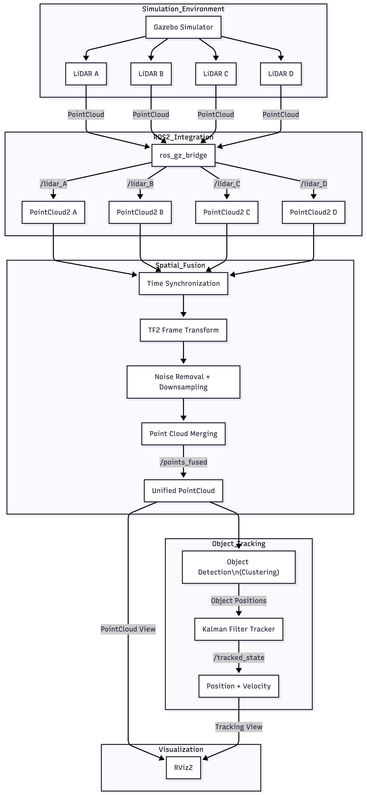

# Multi-LiDAR Spatial and Temporal Sensor Fusion

## Project Overview

This project presents a robust sensor fusion pipeline designed for autonomous robotic systems. The primary objective is the seamless integration of multiple LiDAR sensors to achieve comprehensive 360-degree spatial awareness and stable, high-fidelity temporal tracking. By aggregating point cloud data from disparate perspectives and applying advanced recursive filtering, the system effectively eliminates blind spots and provides precise state estimation for dynamic objects in the environment.

The entire stack is implemented using ROS 2 (Robot Operating System) and validated within the Gazebo Ignition simulation environment, demonstrating a production-ready flow from raw sensor data to refined tracking telemetry.

---

## The Engineering Challenge: Problem and Solution

### The Problem Statement
In high-stakes robotic applications, relying on a single LiDAR sensor introduces significant risks:
1. **Geometric Blind Spots**: Fixed sensor placements often leave "dead zones" where critical obstacles can go undetected.
2. **Data Sparsity**: As distance increases or angles become acute, point density drops, leading to unreliable detection.
3. **Inherent Sensor Noise**: Raw laser returns are subject to environmental noise, causing jittery measurements.
4. **Dynamic Occlusion**: Moving objects can easily be lost when they pass behind other structures from a single viewpoint.

### The Proposed Solution
Our system tackles these challenges through a specialized dual-layer fusion strategy:
1. **Spatial Fusion Layer**: We utilize four strategically oriented LiDAR sensors to provide near-total coverage. Their independent streams are unified into a single, high-density global point cloud.
2. **Temporal Fusion Layer**: A dedicated Kalman Filter processes the aggregated spatial data over time, smoothing out noise and maintaining a continuous "belief" of object trajectories (position and velocity).

---

## Project Architecture

The architecture follows a modular, decoupled design to ensure high performance and maintainability.

### Detailed Architecture Visualization 

The following diagram illustrates the high-level system design and data flow within the project.

#### Architectural Rationale
- **Scalability**: The system is sensor-agnostic; additional LiDAR units can be integrated purely through URDF and bridge configuration changes without altering the core fusion algorithms.
- **Latency Management**: By separating geometric re-projection (spatial) from state estimation (temporal), the system optimizes CPU utilization and maintains real-time throughput.
- **Fault Tolerance**: The pipeline is resilient to individual sensor failure, utilizing remaining inputs and temporal smoothing to maintain a consistent world model.
- **Standardization**: Full compliance with ROS 2 message standards (`sensor_msgs/PointCloud2`, `nav_msgs/Odometry`) ensures interoperability with broader navigation stacks.

---

## Technical Implementation Deep Dive

### 1. Hardware Simulation and URDF Configuration
The robot is modeled with a rectangular base housing four LiDAR sensors (A, B, C, and D) at each corner. The URDF (Unified Robot Description Format) is the "source of truth" for the system's geometry, defining:
- Precise translation and rotation offsets for each sensor.
- The fixed relationship between sensor frames and the `base_link` coordinate system.
- High-fidelity GPU-based LiDAR simulation parameters in Gazebo.

### 2. Spatial Fusion Logic
The `QuadLidarFusionNode` serves as the geometric aggregator for the four asynchronous laser streams.
- **Temporal Alignment**: Utilizes `message_filters.ApproximateTimeSynchronizer` to sync incoming point clouds based on their header timestamps.
- **Frame Transformation**: Each individual cloud is re-projected from its local sensor frame to the `base_link` frame using `tf2` listeners and rotation matrices.
- **Cloud Aggregation**: The transformed points are concatenated into a unified `PointCloud2` message.
- *Note: This version focuses on core fusion. Advanced post-processing like voxel downsampling or statistical outlier removal can be integrated as modular filters.*

### 3. Temporal Fusion and Tracking
The tracking layer ensures that the data is not just spatially accurate but also consistent over time.
- **Measurement Extraction**: The `MeasurementNode` distills the fused point cloud into a single representative centroid (mean position), converting raw points into a `geometry_msgs/PointStamped` measurement.
- **Kalman Filter Implementation**: The `KalmanTrackerNode` implements a linear Kalman Filter using a Constant Velocity (CV) model.
    - **State Vector**: `[x, y, vx, vy]^T` (Position and Velocity).
    - **Prediction Step**: Projects the object's next state based on the current velocity and time delta.
    - **Update Step**: Corrects the predicted state by incorporating the new centroid measurement, effectively weighting sensor data against model certainty.
- **System Output**: The filtered state is published as `nav_msgs/Odometry`, providing smooth, predictable trajectories even under noisy conditions.

---

## Live Demonstration

The following recordings demonstrate the system's performance in the Gazebo environment.

### 2-LiDAR Configuration Performance
Illustrates initial fusion and tracking with a limited sensor setup.
[DEMO VIDEO: 2-LiDAR FUSION](https://github.com/user-attachments/assets/823a323a-3769-4d2b-8030-f9eee17d6546)

### 4-LiDAR Full Coverage Performance
Showcases the final 360-degree coverage and the robust tracking of a moving target.
[DEMO VIDEO: 4-LiDAR FUSION](https://github.com/user-attachments/assets/189006b5-a2df-4d62-bc2f-7b6c6bbfb0b1)

---

## Future Roadmap and Enhancements

1. **Advanced Clustering**: Replace simple centroid extraction with DBSCAN or Euclidean Clustering for multi-object tracking.
2. **Non-Linear Estimation**: Transition to an Extended Kalman Filter (EKF) to support more complex motion models (e.g., CTRV).
3. **Heterogeneous Sensor Fusion**: Integrate RGB-D cameras or Radar data to improve object classification and environmental robustness.
4. **Dynamic Auto-Calibration**: Implement online extrinsic calibration to correct for mounting misalignments in real-time.
5. **Mapping Integration**: Utilize the fused cloud for SLAM or real-time occupancy grid generation for autonomous navigation.
